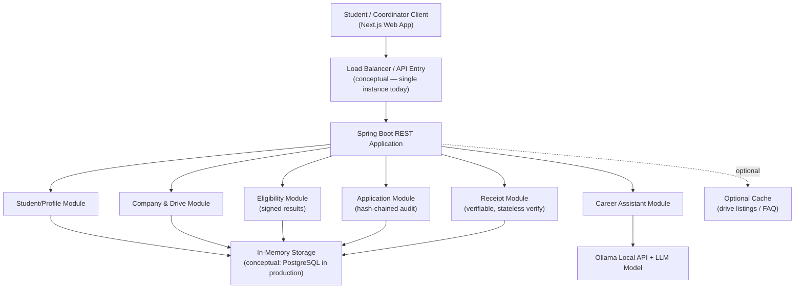

# HLD — Architecture & System-Design Answers

## 1. Architecture Diagram

## 2. System-Design Questions

| Topic | Decision |
|---|---|
| **Scalability** | Read-heavy endpoints (`GET /api/drives`, `GET /api/companies`) can scale horizontally since they're stateless reads; write paths (`applications`, status updates) stay single-writer in this prototype. |
| **Load Balancing** | If multiple backend instances existed, a load balancer would sit between the Next.js client and the Spring Boot instances, in front of the API Entry point shown above. |
| **Availability** | Placement APIs (students/companies/drives/applications/receipts) have zero dependency on Ollama; only `/api/chat` degrades (controlled 503) when Ollama is unavailable — proven in `sequence-chat.md`. |
| **Consistency** | Application creation and status updates require strong consistency (duplicate prevention, valid-transition guarantees, audit-chain integrity) — these are synchronized per-aggregate in-memory today, and would need transactional guarantees (e.g. row-level locking) in a relational production version. FAQ/chat responses tolerate eventual/no consistency since they're advisory only. |
| **Caching** | Drive listings and generic FAQ answers are safe to cache (rarely change, no per-user sensitivity); short TTL (e.g. 60s) with invalidation on drive create/update. Eligibility, application, and receipt data are never cached — they must reflect the live signed/chained state. |
| **SQL vs NoSQL** | A relational database (PostgreSQL) fits students/companies/drives/applications well — clear foreign keys (`drive.companyId`, `application.studentId/driveId`) and the need for uniqueness/transactional constraints (unique email, no duplicate applications). |
| **Partitioning** | `graduationYear` or `campus` would be a reasonable future partition key for students at scale; a hot-partition risk exists around a single high-profile drive attracting a disproportionate share of applications in a short window. |
| **CAP Trade-off** | Application creation/status update is CP-like (must be correct and consistent, can tolerate brief unavailability under partition). Drive listing/FAQ responses are AP-like (must stay available, can tolerate briefly stale data). |

## 3. Design Rationale — Where the Unique Additions Live

- **Signed EligibilityResult** and **Verifiable Receipt** sit at the API boundary of the Eligibility and Receipt modules respectively — this is why they're drawn as part of those modules above, not as a separate "security service": they're a property of the data leaving those modules, not a bolted-on layer.
- **Hash-chained audit trail** lives inside the Application module, alongside — not instead of — the relational-style `applications` table, so it composes cleanly with a future real database.
