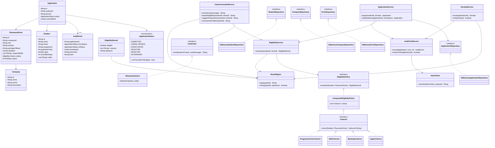

# LLD — Class Diagram

Rendered natively by GitHub (Mermaid). Reflects the actual package structure in `backend/src/main/java/com/trusthire/ai/`.

```mermaid
classDiagram
    class Student {
      -String id
      -String name
      -String email
      -String programme
      -int graduationYear
      -double cgpa
      -int activeBacklogs
      -List~String~ skills
    }

    class Company {
      -String id
      -String name
      -String sector
      -String description
    }

    class PlacementDrive {
      -String id
      -String companyId
      -String role
      -String location
      -String packageOffered
      -Instant deadline
      -List~String~ requiredSkills
      -EligibilityCriteria criteria
      -DriveStatus status
    }

    class Application {
      -String id
      -String studentId
      -String driveId
      -ApplicationStatus status
      -Instant submittedAt
    }

    class ApplicationStatus {
      <<enumeration>>
      SUBMITTED
      UNDER_REVIEW
      SHORTLISTED
      SELECTED
      REJECTED
      WITHDRAWN
      +canTransitionTo(target) bool
    }

    class EligibilityResult {
      -boolean eligible
      -List~String~ reasons
      -String signature
    }

    class AuditEvent {
      -String applicationId
      -ApplicationStatus fromStatus
      -ApplicationStatus toStatus
      -Instant timestamp
      -String prevHash
      -String hash
    }

    class EligibilityPolicy {
      <<interface>>
      +evaluate(Student, PlacementDrive) EligibilityResult
    }

    class Criterion {
      <<interface>>
      +check(Student, PlacementDrive) Optional~String~
    }

    class CompositeEligibilityPolicy {
      -List~Criterion~ criteria
    }

    class CgpaCriterion
    class BacklogCriterion
    class SkillCriterion
    class ProgrammeYearCriterion

    class ChatClient {
      <<interface>>
      +send(systemPrompt, userMessage) String
    }

    class OllamaChatClient {
      -OllamaProperties config
    }

    class ResultSigner {
      +sign(payload) String
      +verify(payload, signature) boolean
    }

    class HashChain {
      +nextHash(prevHash, payload) String
    }

    class StudentRepository { <<interface>> }
    class CompanyRepository { <<interface>> }
    class DriveRepository { <<interface>> }
    class ApplicationRepository { <<interface>> }
    class InMemoryStudentRepository
    class InMemoryCompanyRepository
    class InMemoryDriveRepository
    class InMemoryApplicationRepository

    class ApplicationService {
      +apply(studentId, driveId) Application
      +updateStatus(applicationId, newStatus) Application
    }
    class EligibilityService {
      +evaluate(studentId, driveId) EligibilityResult
    }
    class AuditTrailService {
      +record(application, from, to) AuditEvent
      +verifyChain(applicationId) boolean
    }
    class ReceiptService {
      +issue(applicationId) Receipt
      +verify(receipt) boolean
    }
    class CareerAssistantService {
      +answerFaq(message) String
      +explainEligibility(studentId, driveId) String
      +suggestPreparation(studentId, driveId) String
      +summarizeProfile(studentId) String
    }

    EligibilityPolicy <|.. CompositeEligibilityPolicy
    CompositeEligibilityPolicy o-- Criterion
    Criterion <|.. CgpaCriterion
    Criterion <|.. BacklogCriterion
    Criterion <|.. SkillCriterion
    Criterion <|.. ProgrammeYearCriterion

    ChatClient <|.. OllamaChatClient

    StudentRepository <|.. InMemoryStudentRepository
    CompanyRepository <|.. InMemoryCompanyRepository
    DriveRepository <|.. InMemoryDriveRepository
    ApplicationRepository <|.. InMemoryApplicationRepository

    ApplicationService --> ApplicationRepository
    ApplicationService --> EligibilityService
    ApplicationService --> AuditTrailService
    EligibilityService --> EligibilityPolicy
    EligibilityService --> ResultSigner
    AuditTrailService --> HashChain
    ReceiptService --> ResultSigner
    ReceiptService --> AuditTrailService
    CareerAssistantService --> ChatClient
    CareerAssistantService --> EligibilityService
    CareerAssistantService --> ResultSigner

    Application --> ApplicationStatus
    Application "1" --> "many" AuditEvent
    PlacementDrive --> Company
    Application --> Student
    Application --> PlacementDrive
    EligibilityResult --> ResultSigner
```
