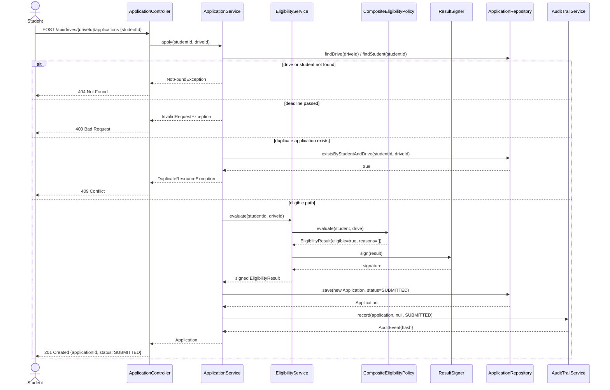

# LLD — Sequence Diagram: Apply to Drive

```mermaid
sequenceDiagram
    actor Student
    participant Controller as ApplicationController
    participant Service as ApplicationService
    participant Elig as EligibilityService
    participant Policy as CompositeEligibilityPolicy
    participant Signer as ResultSigner
    participant Repo as ApplicationRepository
    participant Audit as AuditTrailService

    Student->>Controller: POST /api/drives/{driveId}/applications {studentId}
    Controller->>Service: apply(studentId, driveId)
    Service->>Repo: findDrive(driveId) / findStudent(studentId)
    alt drive or student not found
        Service-->>Controller: NotFoundException
        Controller-->>Student: 404 Not Found
    else deadline passed
        Service-->>Controller: InvalidRequestException
        Controller-->>Student: 400 Bad Request
    else duplicate application exists
        Service->>Repo: existsByStudentAndDrive(studentId, driveId)
        Repo-->>Service: true
        Service-->>Controller: DuplicateResourceException
        Controller-->>Student: 409 Conflict
    else eligible path
        Service->>Elig: evaluate(studentId, driveId)
        Elig->>Policy: evaluate(student, drive)
        Policy-->>Elig: EligibilityResult(eligible=true, reasons=[])
        Elig->>Signer: sign(result)
        Signer-->>Elig: signature
        Elig-->>Service: signed EligibilityResult
        Service->>Repo: save(new Application, status=SUBMITTED)
        Repo-->>Service: Application
        Service->>Audit: record(application, null, SUBMITTED)
        Audit-->>Service: AuditEvent{hash}
        Service-->>Controller: Application
        Controller-->>Student: 201 Created {applicationId, status: SUBMITTED}
    end
```
