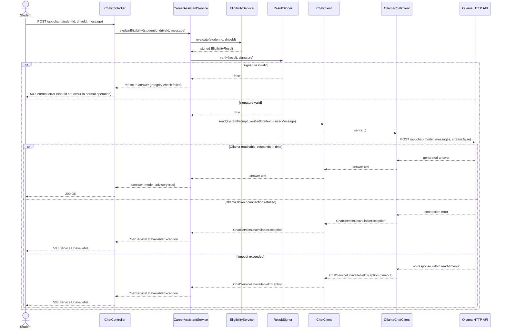

# LLD — Sequence Diagram: Ask AI Assistant

**Note:** all non-chat endpoints (`/api/students`, `/api/drives`, `/api/applications`, etc.) are entirely unaffected by any branch in this diagram — this is what NFR-05 (Availability) requires and what the `ollama-unavailable.png` screenshot must demonstrate.
